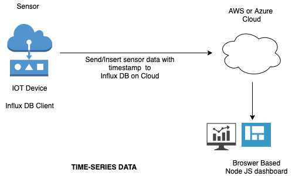

# time-series-iot-data
sending data to influx db-cloud and analyse using node js dashboard

# Steps
Set up the AWS IoT Device Simulator

Set up InfluxDB and Grafana on your own Amazon EC2 instances

Set up AWS IoT Core resources and AWS Lambda function needed to populate the time series database

Develop Grafana dashboard(s) with real-time visualizations to track IoT data

https://aws.amazon.com/blogs/iot/influxdb-and-grafana-with-aws-iot-to-visualize-time-series-data/
